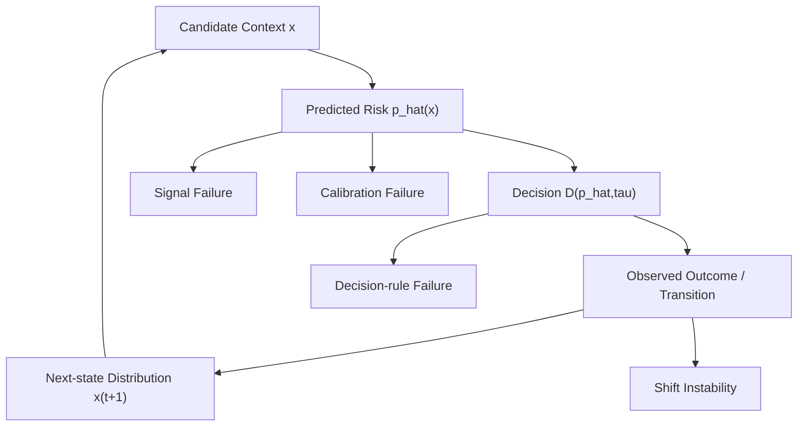

# Risk-UQ Suite Literature Survey (Thesis-Level, Critical, and Falsifiable)

This survey is written to be scientifically useful, not confirmatory. It does not assume our hypothesis is true.

## Purpose and Scope

This document serves two roles:
1. thesis-level survey of decision-causal uncertainty/risk literature,
2. methodological foundation for a top-tier paper on thresholded candidate-level decision quality in closed-loop AV simulation.

Focus setting (explicitly narrow):
- candidate-level action selection,
- thresholded risk decisions (`tau`),
- closed-loop execution,
- distribution shift.

---

## 1) Formal Problem Setup

### 1.1 Risk and Decision Operators

Let `x` denote candidate-action context (scene state, candidate action, rollout features, uncertainty features).

- True (latent) risk function:
  ```text
  p(x) := P(Y = 1 | x)
  ```
  where `Y=1` indicates failure event (collision/offroad/failure proxy at chosen horizon).

- Model-predicted risk used by the controller:
  ```text
  p_hat(x) := f_theta(x)
  ```

- Operational threshold decision operator:
  ```text
  D(p_hat, tau) = 1[p_hat <= tau]
  ```
  where `D=1` means candidate is accepted as safe under budget `tau`.

### 1.2 Decision Correctness at Operating Threshold

Key decision error rates:

- False-safe violation:
  ```text
  FS_p_hat(tau) := P(Y = 1 | p_hat <= tau)
  ```

- Safe-reject rate:
  ```text
  SR_p_hat(tau) := P(Y = 0 | p_hat > tau)
  ```

Target operating-point criterion (ideal threshold-consistency condition):
```text
P(Y = 1 | p_hat <= tau) <= tau
```

This is a desirable operational target, not a guarantee implied by standard global calibration alone.
It is the natural operating-point analogue of probabilistic safety consistency under thresholded acceptance, not a theorem from standard calibration alone.
In practice this is estimated with finite-sample uncertainty, so CI reporting is required.
In practice, `FS_p_hat(tau)` is the primary operating-point safety diagnostic.

### 1.3 Global vs Local Calibration

- Global calibration: risk probabilities are reliable across the full probability range (e.g., ECE/reliability diagram over `[0,1]`).
- Local calibration near `tau`: reliability is specifically correct around the action boundary `p_hat ≈ tau`, where accept/reject flips occur.

Global calibration can look good while local calibration near `tau` is poor.

### 1.4 Core Hypothesis (Operational)

Core hypothesis (`H_core`):
```text
In candidate-level thresholded control, errors in p_hat(x) quality
(ranking and/or calibration near tau) produce measurable decision errors
(false-safe, safe-reject, feasibility collapse), and these errors worsen under shift.
```

Operational implications:
1. If local calibration near `tau` is poor, `FS_p_hat(tau)` or `SR_p_hat(tau)` should increase.
2. If discrimination is weak (low within-step AUC), calibration alone should not recover decision quality.
3. If calibration improves probability quality but not decision outcomes, the bottleneck is likely rule design or candidate quality.
4. Under shift, at least one of calibration or decision metrics should degrade unless robustness mechanisms are present.

---

## 2) Formal Definition: Decision-Grade Risk

We use **decision-grade risk** as an operational composite criterion for threshold control.  
Decision-grade is defined here relative to the thresholded acceptance rule `D(p_hat, tau)`, not as a universal property across all controllers.
We use it as a practical acceptance standard for thresholded candidate control in this specific setting.
A risk signal is decision-grade under this operational definition if all hold:
1. Calibration (especially near `tau`),
2. Discriminative power (candidate ranking quality),
3. Shift stability,
4. Decision correctness and feasibility under `D(p_hat,tau)`.

### 2.1 Metric Mapping

| Property | Required metric(s) |
|---|---|
| Calibration | ECE, reliability curve, NLL, Brier, local calibration error around `tau` |
| Discrimination | AUROC, AUPRC, within-step AUC/ranking |
| Decision correctness | `false_safe(τ)`, `safe_reject(τ)`, empirical failure among accepted |
| Feasibility | `feasible_set_rate(τ)`, `fallback_rate(τ)` |
| Shift robustness | metric deltas across nominal vs shift suites |

---

## 3) Failure Taxonomy (Decision-Causal)

### Type 1: False-safe (unsafe acceptance)
Accepting candidates under budget that still fail.
- Indicator: high `P(Y=1 | p_hat <= tau)`.

### Type 2: Safe-reject (over-conservatism)
Rejecting candidates that would have been safe.
- Indicator: high `P(Y=0 | p_hat > tau)`.

### Type 3: Feasible-set collapse
No candidate satisfies `p_hat <= tau` at many steps.
- Indicators: low `feasible_set_rate`, high `fallback_rate`.

### Type 4: Shift instability
Decision behavior degrades or flips under shift.
- Indicators: large change in FS/SR/feasibility from nominal to shift.

These failure modes can arise from different sources: signal quality, calibration quality, or decision rule design.

---

## 4) Literature Selection Protocol

Inclusion criteria (strict):
1. explicit decision variable exists,
2. uncertainty/risk influences decision,
3. paper reports decision-impact outcomes.

Portfolio used: 30 papers (canonical + SOTA + closest priors + benchmarks).

- Calibration methods: P01-P06
- Uncertainty-aware planning/prediction-to-control: P13-P17
- Risk-constrained/threshold frameworks: P07-P12, P30
- Closed-loop AV benchmarks: P18-P22
- Recent additions (2023-2025): P23-P29

Recent-evidence caveat:
- P23/P24/P27/P28/P29 are emerging and partly preprint-driven; they are included for recency and methodological relevance, not as settled consensus.
- Core argumentative anchors for the main gap remain P01, P05, P07, P10, P15, and P20-P22.

Citation-strength labels are qualitative: `very high`, `high`, `medium`, `emerging`.

### 4.1 Paper Categorization by Decision-Causal Role

| Bucket | IDs | Typical decision variable | What this bucket contributes | Transfer risk to our setting |
|---|---|---|---|---|
| Calibration primitives | P01-P06 | threshold on mapped probability score | shows why raw confidence is not decision-grade by default | often open-loop, weak closed-loop causal evidence |
| Threshold/constraint frameworks | P07-P12, P30 | accept/reject threshold, constrained optimization parameter | formalizes how risk enters decisions (`tau`, risk budget, constraints) | often assumes risk signal is already valid |
| Uncertainty/risk to control | P13-P17, P23-P27 | policy/trajectory cost-constrained action | demonstrates uncertainty-informed planning can improve outcomes | mostly trajectory/policy granularity, not candidate-step threshold audits |
| Closed-loop AV benchmarks | P18-P22 | planner policy rollout in simulation | gives substrate for large-scale safety/efficiency evaluation | does not itself enforce calibration-to-decision auditing |
| Shift-robust conformal extensions | P28-P29 | robust threshold/set filtering under shift | motivates robustness-aware risk control and stress testing | early evidence, limited candidate-level closed-loop validation |

### 4.2 Critical Inclusion Notes

1. A paper can be strong and still weakly transferable if its decision granularity differs (trajectory-level vs candidate-step).
2. A paper can report closed-loop gains but still leave `tau`-level correctness (`FS/SR`) untested.
3. We treat recent preprints as directional evidence, not settled proof.

---

## 5) Decision-Causal Literature Matrix (Critical)

Legend for contradiction vs our hypothesis:
- `No`: supports or is consistent with need for extra calibration/auditing.
- `Partial`: shows conditions where our hypothesis may fail.
- `Untested`: does not directly test our setting.

| ID | Paper | Venue/Year | Role | Risk signal `p_hat(x)` or surrogate | Decision formulation `D` | Granularity | Works well when | Key assumptions | Eval type | Contradiction? | Limitation for our setting |
|---|---|---|---|---|---|---|---|---|---|---|---|
| P01 | Guo et al. (Temp scaling) | ICML 2017 | Canonical | learned logits -> calibrated prob | thresholding by calibrated probs downstream | sample | in-domain moderate shift | val~deploy, IID-ish | open-loop | Partial | no closed-loop decision causality |
| P02 | Niculescu-Mizil & Caruana (Platt/Isotonic) | ICML 2005 | Canonical | monotonic score->probability map | threshold on mapped probs | sample | static supervised settings | score-risk monotonicity | open-loop | Partial | no shift/closed-loop treatment |
| P03 | Dropout as Bayesian Approx | ICML 2016 | Canonical | MC-dropout predictive distribution | utility/risk-based action from predictive stats | step/sample | moderate epistemic uncertainty | dropout approx posterior | mixed (mostly open-loop) | Untested | no tau-level correctness analysis |
| P04 | Lakshminarayanan et al. (Deep Ensembles) | NeurIPS 2017 | Canonical | ensemble mean/variance predictive probs | decision from mean/confidence | sample | broad supervised tasks | diverse members approximate epistemic | open-loop | Untested | no candidate-level tau audit |
| P05 | Ovadia et al. (UQ under shift) | NeurIPS 2019 | Canonical | various predictive uncertainty models | evaluate confidence reliability under shift | sample | distribution shift diagnostics | benchmark shifts representative | open-loop | No | not linked to planner/control rule |
| P06 | Dirichlet Calibration | NeurIPS 2019 | Canonical | parametric map on probability simplex | thresholding on remapped probs | sample | multiclass calibration tasks | calibration split representativeness | open-loop | Partial | no closed-loop decision linkage |
| P07 | Selective Classification | NeurIPS 2017 | Canonical | confidence score as risk proxy | accept if `s>=θ`, reject otherwise | sample/candidate | strong confidence ranking | stationary setting | open-loop | Partial | no temporal coupling/closed-loop dynamics |
| P08 | SelectiveNet | ICML 2019 | Canonical | learned predictor + selector | learned abstain/accept under coverage target | sample/candidate | when coverage objective transfers | train-test similarity | open-loop | Partial | no AV-specific closed-loop evidence |
| P09 | Deep Gamblers | NeurIPS 2019 | Canonical | confidence + reservation utility | bet/reject decision from utility | sample/candidate | controlled classification | utility matches decision costs | open-loop | Untested | no closed-loop control grounding |
| P10 | CPO | ICML 2017 | Canonical | expected safety cost surrogate | `max J_R` s.t. `J_C<=d` | policy/trajectory | good cost surrogate and stable optimization | constraint cost faithful | closed-loop RL | Partial | policy-level not candidate-level tau |
| P11 | RCPS | NeurIPS 2021 | Canonical | calibrated risk functional over sets | choose set parameter for risk target `alpha` | sample/set | exchangeable data | exchangeability | open-loop | No | assumptions strained in adaptive closed-loop |
| P12 | Conformal Risk Control (Angelopoulos et al.) | ICLR 2024 | Canonical | conformalized risk scores | calibrate threshold/parameter to hit risk budget | sample/set | non-adaptive settings | calibration assumptions | open-loop | Partial | closed-loop dependence unmodeled |
| P30 | Planning on a (Risk) Budget (Huang et al.) | arXiv 2021 | Closest prior (budgeted planning) | explicit trajectory risk proxy with budgeted objective | optimize performance under a fixed risk budget | trajectory/step | risk surrogate is informative and budget tuning is representative | risk-proxy fidelity and scenario representativeness | closed-loop simulation | Partial | no candidate-level FS/SR or local-`tau` calibration audit |
| P13 | Policy Gradient for Coherent Risk | NeurIPS 2015 | Canonical formal risk | coherent risk measure (e.g., CVaR) of return | optimize policy under risk functional | policy | stable return/risk estimates | risk estimator and PG assumptions | closed-loop RL | Untested | not thresholded candidate decisions |
| P14 | PETS | NeurIPS 2018 | Canonical uncertainty-control | model uncertainty in dynamics rollouts | MPC: `argmin E[cost]` | step/trajectory | model-valid regions | learned model fidelity | closed-loop control | Partial | no explicit risk calibration around tau |
| P15 | RAP | CoRL 2022 | Closest prior + SOTA | risk-sensitive objective over uncertain forecasts | `argmin E[C]+λRisk(C)` | trajectory/step | interaction regimes in paper | risk functional transfers across scenes | closed-loop planning | No | no explicit FS/SR/tau-local audit |
| P16 | Hierarchical game-theoretic AV planning | ICRA 2019 | Closest prior | surrogate interaction risk in utility | strategic best-response selection | step/trajectory | structured interactions | behavior model fidelity | closed-loop | Partial | surrogate risk, no probabilistic calibration |
| P17 | Safe occlusion-aware active perception | RSS 2021 | Closest prior + SOTA precursor | occlusion hazard surrogate | optimize task reward - risk term with guards | step | occlusion-dominated scenes | occlusion proxy validity | closed-loop | Partial | no threshold-correctness calibration study |
| P18 | CARLA | CoRL 2017 | Benchmark | method-defined | policy rollout in simulator | closed-loop step | benchmarking planners/policies | simulator realism | closed-loop | Untested | no built-in tau decision diagnostics |
| P19 | nuPlan | NeurIPS D&B 2021 | Benchmark | method-defined | planner action/trajectory loop | closed-loop scenario | large scenario suites | benchmark representativeness | closed-loop | Untested | calibration-decision linkage absent |
| P20 | SafeBench | NeurIPS D&B 2022 | Benchmark + SOTA | method-defined under stressors | policy decisions under adversarial/shifted conditions | closed-loop scenario | robustness stress tests | stress suite relevance | closed-loop | No | does not isolate signal vs calibration vs rule |
| P21 | Waymo Open Sim Agents Challenge (WOSAC) | NeurIPS D&B 2023 | Benchmark + SOTA | method-defined interactive agent policy | closed-loop multi-agent action generation | closed-loop scenario | large-scale interaction eval | benchmark metric alignment | closed-loop | Untested | no candidate-level threshold auditing |
| P22 | Gulino et al. (Waymax) | arXiv 2023 | Benchmark substrate | method-defined | fast closed-loop policy rollout | closed-loop step/scenario | large controlled sweeps | simulator shift knobs meaningful | closed-loop | Untested | methodology for decision-grade risk external |
| P23 | RACP: Risk-Aware Contingency Planning with Multi-Modal Predictions | arXiv 2024 (accepted T-IV) | Recent SOTA (emerging citation) | Bayesian belief-weighted multimodal risk | contingency plan minimizing expected+risk-aware cost | trajectory/step | multimodal interaction uncertainty with close-loop replanning | forecast beliefs remain informative | closed-loop simulation | Partial | no explicit tau-local calibration and FS/SR audit |
| P24 | Recursively Feasible Chance-constrained MPC under GMM Uncertainty | arXiv 2024 (TCST 2025) | Recent SOTA (emerging citation) | chance-constrained collision risk under GMM forecasts | optimize trajectory with chance constraints and recursive feasibility conditions | trajectory | multimodal uncertainty with valid propagation assumptions | uncertainty propagation assumptions hold | closed-loop simulation | Partial | guarantees tied to model assumptions; limited candidate-level threshold analysis |
| P25 | Localized Adaptive Risk Control (L-ARC) | NeurIPS 2024 | Recent SOTA (low but fast-growing citation) | localized risk estimate with online threshold function | adaptive threshold update to satisfy local/marginal risk targets | sample/set | non-stationary subgroup risk with online updates | feedback and localization kernels represent subpopulations | open-loop/sequential calibration | Partial | not evaluated in AV closed-loop candidate selection |
| P26 | RADIUS: Risk-Aware, Real-Time, Reachability-Based Motion Planning | RSS 2023 | Recent SOTA (emerging citation) | reachability-derived collision risk upper bound | optimize trajectory under explicit risk threshold constraint | trajectory/step | bounded-risk planning with reachable-set approximation | reachability over-approximation is valid and tractable | closed-loop simulation + hardware | Partial | risk bound is conservative surrogate, not calibrated probabilistic score near tau |
| P27 | Muthali et al. (MARC: Multi-Agent Reachability Calibration with Conformal Prediction) | arXiv 2023 | Recent adjacent prior (emerging citation) | conformal prediction sets + reachability risk envelope | certify planning safety using calibrated prediction sets | trajectory/set | forecasting errors are calibratable and exchangeability-like assumptions hold | simulation + physical vehicle demo | closed-loop safety certification | Partial | focuses on set guarantees, not candidate-level FS/SR decomposition at fixed tau |
| P28 | CUQDS (Conformal UQ under distribution shift for trajectory prediction) | arXiv 2024 | Recent adjacent prior (emerging citation) | shift-aware conformal uncertainty sets for trajectory outcomes | decision support via uncertainty sets/coverage controls under shift | trajectory/set | shift assumptions are captured by calibration strategy | open-loop trajectory prediction eval | Partial | no candidate-level `D(p_hat,tau)` audit in closed-loop AV control |
| P29 | Adversarially Robust Conformal Prediction for Interactive Safe Planning | arXiv 2025 | Recent robust CP direction (emerging citation) | robust conformal risk sets under interactive shift/adversarial response | thresholded/set-based safety filtering for planning | trajectory/set | robustness assumptions approximate interaction dynamics | simulation-focused | Partial | does not yet establish standardized candidate-level FS/SR/feasibility protocol in Waymax-style closed-loop reranking |

### 5.1 Deep Extraction of Closest and Anchor Papers

The table below adds decision-causal detail for papers most load-bearing to our framing.

| ID | Decision rule (canonical form) | How uncertainty/risk enters | Probabilities assumed calibrated? | Decision-impact metrics reported | Critical limitation vs our target |
|---|---|---|---|---|---|
| P01 | `p_cal = sigmoid(logit/T)` then threshold/rank | post-hoc calibration map on model score | no; explicitly addresses miscalibration | ECE/NLL in classification settings | no closed-loop or candidate-step decision audit |
| P05 | evaluate reliability under shifts, no control rule | uncertainty scores are stress-tested under OOD | no; tests degradation | calibration and error under shift | does not connect to planner action selection |
| P07 | accept if confidence `>= theta` else reject | confidence acts as risk surrogate | often implicit | selective risk/coverage | single-sample decision, no temporal coupling |
| P10 | `max J_R(pi)` s.t. `J_C(pi) <= d` | safety cost as constrained objective | implicit surrogate fidelity | reward-cost tradeoff in RL | policy-level, not candidate-level thresholded control |
| P11 | choose parameter to satisfy risk target `alpha` | conformalized risk functional controls coverage/risk | assumes exchangeability-like conditions | risk-control guarantees | assumptions strained in adaptive closed-loop |
| P12 | calibrate threshold/parameter for risk budget | conformal risk score enters constraint | partially; robust finite-sample framing | risk target satisfaction | not designed for step-level planner feedback loops |
| P30 | optimize planning objective under explicit risk budget | risk proxy enters hard/soft budget constraint | mostly implicit | safety-performance tradeoff in planning | lacks candidate-step threshold correctness diagnostics |
| P15 | `argmin E[C] + lambda * Risk(C)` | multimodal forecast uncertainty in planning cost | mostly implicit | safety/progress under interaction | no explicit calibration-to-decision link (`FS/SR`) |
| P20 | stress-test planner decisions under perturbation | robustness signals through closed-loop stress suites | not a calibration paper | safety/robustness benchmark metrics | no candidate-level threshold accounting |
| P22 | fast simulator rollout of planner policies | external method risk signals can be plugged in | N/A (substrate) | closed-loop scenario outcomes | no built-in decision-grade risk protocol |
| P24 | chance-constrained MPC feasibility conditions | collision risk enters chance constraints | assumes model/propagation validity | collision/constraint violation tradeoff | constraints are model-dependent, not local-calibration audited |
| P27 | conformal sets + reachability safety envelope | uncertainty set drives safety filtering | partially; conformal assumptions | safety certification style outcomes | set-level guarantees, limited candidate threshold diagnostics |
| P29 | robust conformal filtering under interaction shift | adversarially robust uncertainty sets gate decisions | partially; robustness assumptions required | robust safety-focused metrics | early-stage evidence, no standard Waymax candidate-step protocol |

### 5.2 Per-Bucket Critical Takeaways

1. Calibration bucket (P01-P06): strong evidence that score-to-probability mapping matters, weak evidence that this alone fixes closed-loop decisions.
2. Threshold/constraint bucket (P07-P12, P30): strong decision-theoretic framing, but often relies on unverified risk signal quality.
3. Risk-to-control bucket (P13-P17, P23-P27): strong safety-control integration, but mainly trajectory/policy granularity and sparse `tau`-local auditing.
4. Benchmark bucket (P18-P22): strong substrate for rigorous evaluation, but methodology for decision-grade risk must be supplied externally.
5. Shift-robust conformal bucket (P28-P29): promising for robustness, but still limited direct evidence at candidate-step decision granularity.

---

## 6) Unifying Abstraction Across Literature

All papers can be projected onto two objects:
1. `p_hat(x)` (estimated risk signal, targeting latent `p(x)`)
2. `D(p_hat, tau)` (decision operator at operating threshold)

### 6.1 Where papers cluster

- Papers modeling `p_hat(x)` but weakly auditing `D`:
  P01-P06, P03-P05 (uncertainty/calibration emphasis).

- Papers defining `D` but assuming `p_hat(x)` is adequate:
  P07-P12, P30, P10, P13, P16-P17.

- Papers enabling closed-loop measurement but not this linkage:
  P18-P22.

### 6.2 Missing connection

The under-tested link is:
```text
quality of p_hat(x) => correctness of D(p_hat, tau) => closed-loop outcomes under shift
```

### 6.3 Decision Granularity Mismatch

Most prior works report success at trajectory-level or policy-level decisions, while our target is step-time candidate-level acceptance/rejection under `tau`.

Consequence:
1. a method can look strong on aggregate trajectory metrics,
2. yet still fail at candidate-level threshold correctness (`false_safe`, `safe_reject`, feasibility) where the controller actually commits actions.

### 6.4 Cross-Paper Coverage Audit (29-paper coding)

Based on coded attributes in Section 5 (conservative interpretation):

| Audit dimension | Approximate coverage in surveyed set | Interpretation |
|---|---|---|
| Explicit decision variable present | `30/30` | enforced by inclusion criteria |
| Uncertainty/risk directly used in decision | `30/30` | enforced by inclusion criteria |
| Closed-loop evaluation reported | `~16/30` | many papers still open-loop or mixed |
| Calibration quality explicitly evaluated | `~10/30` | calibration is often assumed rather than measured |
| Shift robustness explicitly audited | `~11/30` | robustness increasingly present but heterogeneous |
| Candidate-step granularity (our target) | `~4/30` | major representation gap |
| Reports both FS-like and SR-like threshold errors | `~1-2/30` | decision correctness diagnostics are rarely complete |
| Joint test of `calibration -> decision -> closed-loop` chain | `0/30` found in this survey coding | core conjunction remains missing |

These counts are not a meta-analysis claim; they are a structured coding summary to expose where evidence is dense vs sparse.

### 6.5 Assumption Stress Test for Our Setting

| Common assumption in prior work | Why it can fail in our setting | Observable failure mode |
|---|---|---|
| Validation and deployment distributions are close | closed-loop feedback + perturbation shifts change state visitation | ECE stable globally but FS/SR degrade near `tau` |
| Risk surrogate is monotone with true failure probability | candidate interactions can break monotonicity locally | low within-step AUC, unstable ranking by step |
| Constraint/cost surrogate is faithful | proxy may optimize conservatism rather than true safety | high safe-reject and fallback |
| Exchangeability/IID-like calibration conditions | adaptive policy alters future samples | weak finite-sample guarantee transfer under long rollouts |
| Trajectory-level success implies step-level correctness | local decision errors can average out in aggregate metrics | hidden false-safe pockets despite acceptable scenario averages |

---

## 7) Balanced Scientific Analysis

### 7.1 Supporting evidence (for our concern)

1. Calibration can degrade under shift (P05), so raw uncertainty is not always decision-ready.
2. Threshold decisions are sensitive to score quality and coverage/risk threshold design (P07-P09, P11-P12).
3. Closed-loop risk-aware planners can improve outcomes while still using surrogate risk signals that are not explicitly calibration-audited (P15-P17, P23-P27).
4. Recent robust conformal directions (P28-P29) support the importance of shift-aware decision protection, while still leaving candidate-step diagnostics underdeveloped.

### 7.2 Counter-evidence (against over-claiming)

1. In stable regimes, simple calibration can be sufficient for threshold decisions (P01, P02, P06).
2. Constraint-based optimization can succeed if the safety-cost surrogate is faithful (P10, P24).
3. Risk-aware planners can improve outcomes without explicit probability calibration (P15, P17, P26).
4. Benchmark-driven robustness gains can come from planner architecture changes rather than calibration improvements alone (P20-P22).

### 7.3 What is well-supported vs unclear

Well-supported:
1. calibration failures exist, especially under shift,
2. decision rules can dominate outcomes even with similar predictors,
3. constraints can help when modeling assumptions hold.

Unclear/under-tested in our exact setting:
1. candidate-level signal strength under shift,
2. tau-local calibration adequacy,
3. whether decision failures are mostly signal, calibration, or rule design.
4. whether recent risk-bounded planners (P23-P29) remain decision-correct at fixed candidate-level `tau`.
5. whether improvements in global calibration consistently reduce false-safe at the operating threshold.

Research questions induced by these gaps:
1. `RQ1`: Is candidate-level risk signal strength sufficient under shift?
2. `RQ2`: Is local calibration near `tau` sufficient for decision correctness?
3. `RQ3`: Which failure source dominates: signal, calibration, or decision rule?

---

## 8) Failure-Source Separation (with Literature Mapping)

| Source | Definition | Literature support | Strength | What remains untested for us |
|---|---|---|---|---|
| Signal failure | weak `p_hat(x)` ranking/discrimination | indirectly discussed; direct candidate-level AV evidence sparse | Medium | within-step AUC and ranking stability under shift |
| Calibration failure | predictive score but wrong numeric probability | strongly supported (P01, P05, P06, P25) | High | local calibration near operating `tau` in closed-loop |
| Decision-rule failure | good `p_hat(x)` but poor mapping to actions | selective + constrained methods imply this (P07-P10, P23-P24) | Medium | ablations isolating rule from model quality |

Inference discipline:
- If outcomes worsen, literature does not justify blaming calibration alone without checking signal and decision rule.

### 8.1 Cross-Paper Diagnostic Logic (What to Test First)

| Observed empirical pattern | Most plausible source | Cross-paper support | Immediate falsification test |
|---|---|---|---|
| low AUROC/within-step AUC and high ECE | signal + calibration | P05, P07-P09 | oracle-risk ablation with same candidate set |
| good ranking but high ECE/NLL near `tau` | calibration | P01, P02, P06, P25 | local calibration window analysis + post-hoc calibration |
| calibrated metrics improve, decisions do not | decision rule | P10-P12, P30, P24 | fixed-signal rule sweep (`tau`, scoring weights, fallback policy) |
| low feasible-set and high fallback despite low failure | over-conservative thresholding | P07-P09, P24, P26 | `tau` sweep with SR and feasibility CIs |
| nominal performance good, shift degrades sharply | shift instability / assumption break | P05, P20, P28-P29 | per-shift deltas with bootstrap CIs and stress-suite stratification |

---

## 9) Why This Matters Now

1. Learned planners are increasingly deployed in closed-loop simulation pipelines.
2. Large-scale simulators (Waymax, WOSAC, nuPlan, SafeBench) make threshold-level diagnostics feasible.
3. Safety claims are moving from aggregate metrics toward operational decision correctness.

### 9.1 Closed-Loop Dependence Caveat

Closed-loop data are policy-dependent and non-IID: decisions at time `t` alter future state visitation and therefore future data distribution.  
Implication: classical calibration/conformal guarantees derived under IID or exchangeability can weaken unless dependence-aware protocols are used.

---

## 10) Null Hypothesis and Falsifiability

### Null hypothesis (H0)

Existing uncertainty-derived risk signals are sufficient for threshold-based decision-making without extra calibration or decision auditing.

### Evidence supporting H0

1. near-`tau` local calibration is already good,
2. low false-safe and low safe-reject across nominal + shifts,
3. minimal fallback/feasible-set collapse,
4. no meaningful improvement from calibration/auditing interventions.

### Evidence refuting H0

1. local miscalibration near `tau`,
2. high false-safe or high safe-reject at operating thresholds,
3. degradation/instability under shift,
4. significant gains after calibration or rule redesign with same candidate set.

### What would refute this research program?

If a strong baseline risk signal already achieves low `false_safe`, low `safe_reject`, and low fallback across nominal and shift suites, and extra calibration/auditing yields negligible improvement, then the proposed decision-grade auditing layer provides little additional value.

---

## 11) Refined Research Gap (Precise and Defensible)

Conjunctive claim from this survey: we did not find prior work that jointly
1. evaluates candidate-level `tau`-threshold correctness via `false_safe` / `safe_reject` / feasibility metrics,
2. distinguishes global calibration from local calibration near operating `tau`,
3. tests closed-loop behavior under controlled distribution shifts, and
4. decomposes failures into signal vs calibration vs decision-rule components.

This is the primary gap statement.  
Prior work provides strong components (calibration methods, risk-aware planning, constraint frameworks, and closed-loop benchmarks), but does not close this full conjunction in one protocol.

This is a scoped gap about missing **linkage and evaluation protocol**, not a claim that prior methods are invalid.
It directly operationalizes `H_core` from Section 1.4 into falsifiable evaluation requirements.

---

## 12) Methodology Justification (Class of Needed Solutions)

A suitable methodological class should include:
1. candidate-level risk estimation `p_hat(x)` with ranking diagnostics,
2. calibration targeted near operational `tau` (not only global ECE),
3. explicit decision-audit metrics (`false_safe`, `safe_reject`, feasibility, fallback),
4. closed-loop shift-suite evaluation,
5. decomposition experiments to attribute errors to signal vs calibration vs decision-rule.

This defines the method class without forcing one specific algorithm.

---

## 13) Explicit Limitations of Our Hypothesis

Our hypothesis may fail if:
1. baseline risk signal is already strong and locally calibrated near `tau`,
2. decision rule is already near-optimal and robust,
3. shifts are weak or not safety-relevant,
4. event rates are too low for stable false-safe estimation.

Required evidence to resolve uncertainty:
1. per-shift candidate-level discrimination,
2. local calibration around `tau`,
3. threshold sweep with confidence intervals,
4. controlled rule/model ablations and oracle tests.

---

## 14) Balanced Conclusion

What literature establishes reliably:
1. uncertainty and risk constraints can improve behavior,
2. calibration methods often improve probability quality,
3. shift can break uncertainty reliability,
4. closed-loop benchmarks make such evaluation practically feasible, though validity still depends on protocol design.

What literature does not settle for our target setting:
1. whether candidate-level threshold decisions are correct at operational `tau`,
2. whether calibration improvements causally improve closed-loop outcomes,
3. which failure source dominates when threshold policies fail.

Therefore, a decomposition-first, falsifiable methodology is justified.

---

## 15) Visual Taxonomy and Experiment Roadmap

### 15.1 Failure Taxonomy Diagram



### 15.2 Failure Source to Experiment Map

| Failure source | Diagnostic experiment | Primary metrics | Pass/fail interpretation |
|---|---|---|---|
| Signal failure | Candidate-level ranking test per step and per shift | AUROC, AUPRC, within-step AUC | Low discrimination means better calibration alone is unlikely to fix control decisions |
| Calibration failure | Global + local reliability analysis around `tau` | ECE, NLL, Brier, local bin error near `tau` | Large local error near `tau` implies threshold decisions are numerically unreliable |
| Decision-rule failure | Hold `p_hat(x)` fixed, compare threshold/gating/reranking rules | `false_safe`, `safe_reject`, progress, comfort, fallback | If outcomes vary strongly by rule, mapping from risk to action is bottleneck |
| Feasible-set collapse | Threshold sweep and feasible-candidate accounting | feasible_set_rate, fallback_rate, accepted count | Persistent low feasibility indicates over-conservative decision policy |
| Shift instability | Repeat diagnostics across nominal and shift suites | delta ECE, delta FS/SR, delta feasibility | Large deltas indicate non-robust operating-point behavior |

### 15.3 Minimal Causal Ablation Grid

| Risk source | Decision rule | Purpose |
|---|---|---|
| Raw `p_hat` | Fixed baseline rule | Baseline operating point |
| Calibrated `p_hat` | Same baseline rule | Isolate calibration effect |
| Oracle-risk proxy | Same baseline rule | Upper-bound achievable with current rule |
| Calibrated `p_hat` | Alternative rule | Isolate decision-rule effect |

This grid is designed to attribute failures to signal quality, calibration quality, or decision-rule design.

---

## Local PDF Directory

All referenced PDFs are stored under:
`experiments/risk-uq-suite/references/pdfs/`

## Reference Index (ID -> Local PDF)

| ID | Local PDF |
|---|---|
| P01 | `guo_2017.pdf` |
| P02 | `niculescu_mizil_caruana_2005.pdf` |
| P03 | `dropout_bayesian_2016.pdf` |
| P04 | `deep_ensembles_2017.pdf` |
| P05 | `ovadia_2019.pdf` |
| P06 | `dirichlet_2019.pdf` |
| P07 | `selective_classification_2017.pdf` |
| P08 | `selectivenet_2019.pdf` |
| P09 | `deep_gamblers_2019.pdf` |
| P10 | `cpo_2017.pdf` |
| P11 | `rcps_2021.pdf` |
| P12 | `conformal_risk_control_iclr_2024.pdf` |
| P13 | `policy_gradient_coherent_risk_2015.pdf` |
| P14 | `pets_2018.pdf` |
| P15 | `rap_corl_2022.pdf` |
| P16 | `hierarchical_game_theoretic_icra_2019.pdf` |
| P17 | `safe_occlusion_active_perception_rss_2021.pdf` |
| P18 | `carla_corl_2017.pdf` |
| P19 | `nuplan_2021.pdf` |
| P20 | `safebench_2022.pdf` |
| P21 | `wosac_2023.pdf` |
| P22 | `waymax_2023.pdf` |
| P23 | `racp_2024.pdf` |
| P24 | `safe_ccmpc_gmm_2024.pdf` |
| P25 | `localized_adaptive_risk_control_2024.pdf` |
| P26 | `radius_2023.pdf` |
| P27 | `marc_2023.pdf` |
| P28 | `cuqds_2024.pdf` |
| P29 | `adversarial_robust_conformal_interactive_planning_2025.pdf` |
| P30 | `planning_risk_budget_2021.pdf` |
